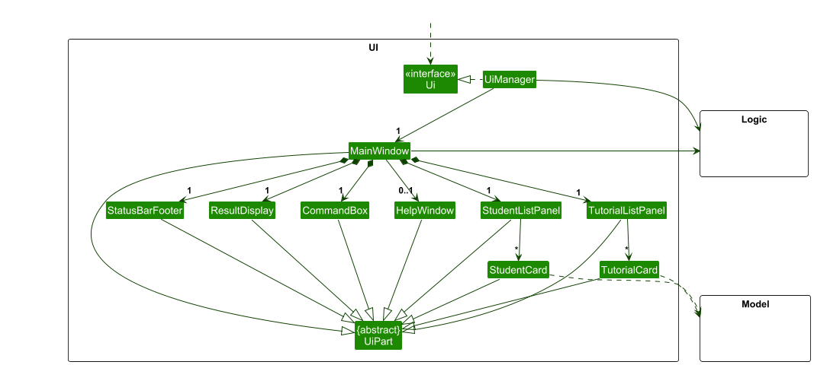
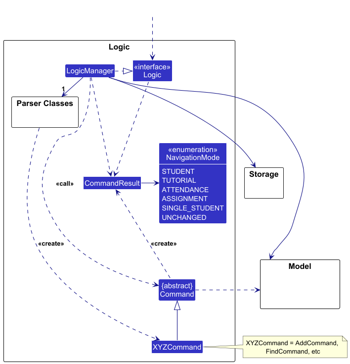
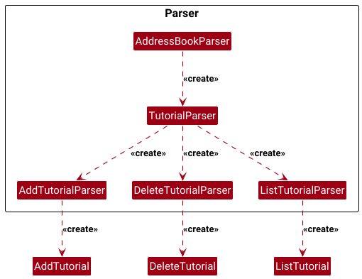
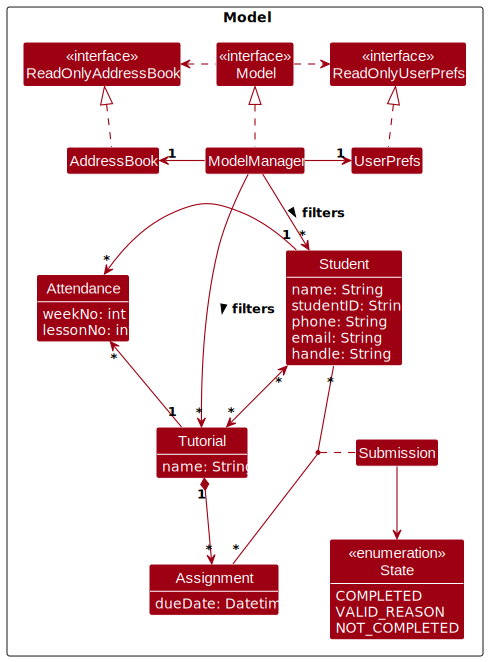
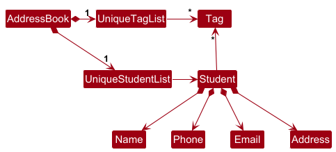
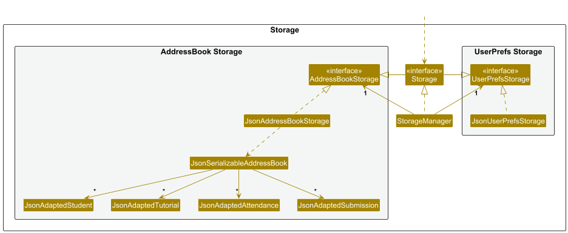

<!-- prettier-ignore -->
- Table of Contents
{:toc}

---

## **Acknowledgements**

- {list here sources of all reused/adapted ideas, code, documentation, and third-party libraries -- include links to the original source as well}

---

## **Setting up, getting started**

Refer to the guide [_Setting up and getting started_](SettingUp.md).

---

## **Design**

:bulb: **Tip:** The `.puml` files used to create diagrams in this document `docs/diagrams` folder. Refer to the [_PlantUML Tutorial_ at se-edu/guides](https://se-education.org/guides/tutorials/plantUml.html) to learn how to create and edit diagrams.

### Architecture

The **_Architecture Diagram_** given above explains the high-level design of the App.

Given below is a quick overview of main components and how they interact with each other.

**Main components of the architecture**

**`Main`** (consisting of classes [`Main`](https://github.com/se-edu/addressbook-level3/tree/master/src/main/java/seedu/address/Main.java) and [`MainApp`](https://github.com/se-edu/addressbook-level3/tree/master/src/main/java/seedu/address/MainApp.java)) is in charge of the app launch and shut down.

- At app launch, it initializes the other components in the correct sequence, and connects them up with each other.
- At shut down, it shuts down the other components and invokes cleanup methods where necessary.

The bulk of the app's work is done by the following four components:

- [**`UI`**](#ui-component): The UI of the App.
- [**`Logic`**](#logic-component): The command executor.
- [**`Model`**](#model-component): Holds the data of the App in memory.
- [**`Storage`**](#storage-component): Reads data from, and writes data to, the hard disk.

[**`Commons`**](#common-classes) represents a collection of classes used by multiple other components.

**How the architecture components interact with each other**

The _Sequence Diagram_ below shows how the components interact with each other for the scenario where the user issues the command `delete 1`.

Each of the four main components (also shown in the diagram above),

- defines its _API_ in an `interface` with the same name as the Component.
- implements its functionality using a concrete `{Component Name}Manager` class (which follows the corresponding API `interface` mentioned in the previous point.

For example, the `Logic` component defines its API in the `Logic.java` interface and implements its functionality using the `LogicManager.java` class which follows the `Logic` interface. Other components interact with a given component through its interface rather than the concrete class (reason: to prevent outside component's being coupled to the implementation of a component), as illustrated in the (partial) class diagram below.

The sections below give more details of each component.

### UI component

The **API** of this component is specified in [`Ui.java`](https://github.com/se-edu/addressbook-level3/tree/master/src/main/java/seedu/address/ui/Ui.java)

The UI consists of a `MainWindow` that is made up of parts e.g.`CommandBox`, `ResultDisplay`, `StudentListPanel`, `TutorialListPanel`, `AttendanceListPanel`, `StatusBarFooter` etc. All these, including the `MainWindow`, inherit from the abstract `UiPart` class which captures the commonalities between classes that represent parts of the visible GUI.

The `UI` component uses the JavaFx UI framework. The layout of these UI parts are defined in matching `.fxml` files that are in the `src/main/resources/view` folder. For example, the layout of the [`MainWindow`](https://github.com/se-edu/addressbook-level3/tree/master/src/main/java/seedu/address/ui/MainWindow.java) is specified in [`MainWindow.fxml`](https://github.com/se-edu/addressbook-level3/tree/master/src/main/resources/view/MainWindow.fxml)

The `UI` component,

- executes user commands using the `Logic` component.
- listens for changes to `Model` data so that the UI can be updated with the modified data.
- keeps a reference to the `Logic` component, because the `UI` relies on the `Logic` to execute commands.
- depends on some classes in the `Model` component, as it displays `Student` object residing in the `Model`.

### Logic component

**API** : [`Logic.java`](https://github.com/se-edu/addressbook-level3/tree/master/src/main/java/seedu/address/logic/Logic.java)

Here's a (partial) class diagram of the `Logic` component:

The sequence diagram below illustrates the interactions within the `Logic` component, taking `execute("delete 1")` API call as an example.

:information_source: **Note:** The lifeline for `DeleteCommandParser` should end at the destroy marker (X) but due to a limitation of PlantUML, the lifeline continues till the end of diagram.

How the `Logic` component works:

1. When `Logic` is called upon to execute a command, it is passed to an `AddressBookParser` object which in turn creates a parser that matches the command (e.g., `DeleteCommandParser`) and uses it to parse the command.
1. This results in a `Command` object (more precisely, an object of one of its subclasses e.g., `DeleteCommand`) which is executed by the `LogicManager`.
1. The command can communicate with the `Model` when it is executed (e.g. to delete a student). 
   Note that although this is shown as a single step in the diagram above (for simplicity), in the code it can take several interactions (between the command object and the `Model`) to achieve.
1. The result of the command execution is encapsulated as a `CommandResult` object which is returned back from `Logic`.

Here are the other classes in `Logic` (omitted from the class diagram above) that are used for parsing a user command:

How the parsing works:

- When called upon to parse a user command, the `AddressBookParser` class creates an `XYZCommandParser` (`XYZ` is a placeholder for the specific command name e.g., `AddCommandParser`) which uses the other classes shown above to parse the user command and create a `XYZCommand` object (e.g., `AddCommand`) which the `AddressBookParser` returns back as a `Command` object.
- All `XYZCommandParser` classes (e.g., `AddCommandParser`, `DeleteCommandParser`, ...) inherit from the `Parser` interface so that they can be treated similarly where possible e.g, during testing.

In addition to having simple single-word command,
our app supports commands with subcommands (e.g. `tutorial add`, `tutorial delete`).
Our implementation is similar to that of a Recursive Descent Parser.

Here is a (partial) diagram showing how the recursive parsing works,
using the `TutorialParser` as an example
(classes not involved are omitted):

How the parsing works:

1. The `AddressBookParser` will match the first word,
   and match against a `Command` object, or another `Parser` object
   - The algorithm terminates if it maps to a `Command` object.
1. If it maps to a `Parser` object,
   then it will call `Parser#parse` of that object
   - The `parse` method will map the next word to either a `Command` or `Parser` object.
   - The process repeats recursively until it eventually resolves to a `Command` object.

### Model component

**API** : [`Model.java`](https://github.com/se-edu/addressbook-level3/tree/master/src/main/java/seedu/address/model/Model.java)

The `Model` component,

- stores the address book data i.e., all `Student` objects (which are contained in a `UniqueStudentList` object).
- stores the currently 'selected' `Student` objects (e.g., results of a search query) as a separate _filtered_ list which is exposed to outsiders as an unmodifiable `ObservableList<Student>` that can be 'observed' e.g. the UI can be bound to this list so that the UI automatically updates when the data in the list change.
- stores a `UserPref` object that represents the user’s preferences. This is exposed to the outside as a `ReadOnlyUserPref` objects.
- does not depend on any of the other three components (as the `Model` represents data entities of the domain, they should make sense on their own without depending on other components)

:information_source: **Note:** An alternative (arguably, a more OOP) model is given below. It has a `Tag` list in the `AddressBook`, which `Student` references. This allows `AddressBook` to only require one `Tag` object per unique tag, instead of each `Student` needing their own `Tag` objects. 

### Storage component

**API** : [`Storage.java`](https://github.com/se-edu/addressbook-level3/tree/master/src/main/java/seedu/address/storage/Storage.java)

The `Storage` component,

- can save both address book data and user preference data in JSON format, and read them back into corresponding objects.
- inherits from both `AddressBookStorage` and `UserPrefStorage`, which means it can be treated as either one (if only the functionality of only one is needed).
- depends on some classes in the `Model` component (because the `Storage` component's job is to save/retrieve objects that belong to the `Model`)

### Common classes

Classes used by multiple components are in the `seedu.address.commons` package.

### Student functionality

The sequence diagram below illustrates the interactions within the `Logic` and `Model` components,
for executing the 3 key commands for functionalities related to students in TAskbook.

#### `add` Command

#### `edit` Command

#### `delete` Command

---

## **Implementation**

This section describes some noteworthy details on how certain features are implemented.

### \[Proposed\] Undo/redo feature

#### Proposed Implementation

The proposed undo/redo mechanism is facilitated by `VersionedAddressBook`. It extends `AddressBook` with an undo/redo history, stored internally as an `addressBookStateList` and `currentStatePointer`. Additionally, it implements the following operations:

- `VersionedAddressBook#commit()` — Saves the current address book state in its history.
- `VersionedAddressBook#undo()` — Restores the previous address book state from its history.
- `VersionedAddressBook#redo()` — Restores a previously undone address book state from its history.

These operations are exposed in the `Model` interface as `Model#commitAddressBook()`, `Model#undoAddressBook()` and `Model#redoAddressBook()` respectively.

Given below is an example usage scenario and how the undo/redo mechanism behaves at each step.

Step 1. The user launches the application for the first time. The `VersionedAddressBook` will be initialized with the initial address book state, and the `currentStatePointer` pointing to that single address book state.

Step 2. The user executes `delete 5` command to delete the 5th student in the address book. The `delete` command calls `Model#commitAddressBook()`, causing the modified state of the address book after the `delete 5` command executes to be saved in the `addressBookStateList`, and the `currentStatePointer` is shifted to the newly inserted address book state.

Step 3. The user executes `add n/David …​` to add a new student. The `add` command also calls `Model#commitAddressBook()`, causing another modified address book state to be saved into the `addressBookStateList`.

:information_source: **Note:** If a command fails its execution, it will not call `Model#commitAddressBook()`, so the address book state will not be saved into the `addressBookStateList`.

Step 4. The user now decides that adding the student was a mistake, and decides to undo that action by executing the `undo` command. The `undo` command will call `Model#undoAddressBook()`, which will shift the `currentStatePointer` once to the left, pointing it to the previous address book state, and restores the address book to that state.

:information_source: **Note:** If the `currentStatePointer` is at index 0, pointing to the initial AddressBook state, then there are no previous AddressBook states to restore. The `undo` command uses `Model#canUndoAddressBook()` to check if this is the case. If so, it will return an error to the user rather
than attempting to perform the undo.

The following sequence diagram shows how an undo operation goes through the `Logic` component:

:information_source: **Note:** The lifeline for `UndoCommand` should end at the destroy marker (X) but due to a limitation of PlantUML, the lifeline reaches the end of diagram.

Similarly, how an undo operation goes through the `Model` component is shown below:

The `redo` command does the opposite — it calls `Model#redoAddressBook()`, which shifts the `currentStatePointer` once to the right, pointing to the previously undone state, and restores the address book to that state.

:information_source: **Note:** If the `currentStatePointer` is at index `addressBookStateList.size() - 1`, pointing to the latest address book state, then there are no undone AddressBook states to restore. The `redo` command uses `Model#canRedoAddressBook()` to check if this is the case. If so, it will return an error to the user rather than attempting to perform the redo.

Step 5. The user then decides to execute the command `list`. Commands that do not modify the address book, such as `list`, will usually not call `Model#commitAddressBook()`, `Model#undoAddressBook()` or `Model#redoAddressBook()`. Thus, the `addressBookStateList` remains unchanged.

Step 6. The user executes `clear`, which calls `Model#commitAddressBook()`. Since the `currentStatePointer` is not pointing at the end of the `addressBookStateList`, all address book states after the `currentStatePointer` will be purged. Reason: It no longer makes sense to redo the `add n/David …​` command. This is the behavior that most modern desktop applications follow.

The following activity diagram summarizes what happens when a user executes a new command:

#### Design considerations:

**Aspect: How undo & redo executes:**

- **Alternative 1 (current choice):** Saves the entire address book.

  - Pros: Easy to implement.
  - Cons: May have performance issues in terms of memory usage.

- **Alternative 2:** Individual command knows how to undo/redo by
  itself.
  - Pros: Will use less memory (e.g. for `delete`, just save the student being deleted).
  - Cons: We must ensure that the implementation of each individual command are correct.

_{more aspects and alternatives to be added}_

### \[Proposed\] Data archiving

_{Explain here how the data archiving feature will be implemented}_

---

## **Documentation, logging, testing, configuration, dev-ops**

- [Documentation guide](Documentation.md)
- [Testing guide](Testing.md)
- [Logging guide](Logging.md)
- [Configuration guide](Configuration.md)
- [DevOps guide](DevOps.md)

---

## **Appendix: Requirements**

### Product scope

**Target user profile**:

- is a teaching assistant (TA) in higher education

  - manages a significant number of student contacts
  - assists professors in coursework and attendance
    - tutorials
    - assignments

- prefer desktop apps over other types
- is reasonably comfortable using CLI apps
  - prefers typing to mouse interactions
  - can type fast

**Value proposition**: manage TA student contacts & administrative tasks faster than a typical mouse/GUI driven app

### **User Stories**

| Priority | As a … | I want to …                                                      | So that I can …                                                                            | Accepted? |
| -------- | ------ | ---------------------------------------------------------------- | ------------------------------------------------------------------------------------------ | --------- |
| High     | TA     | Add a student's data                                             | Find their details to contact them if needed                                               | Yes       |
| High     | TA     | View a list of all students                                      | See all students I have created                                                            | Yes       |
| High     | TA     | Delete a student's data                                          | Make space for the next semester's class                                                   | Yes       |
| Medium   | TA     | Edit a student's data                                            | Make changes to students without deleting and adding them again                            | Yes       |
| Medium   | TA     | Search for student's data entry using name                       | Locate students efficiently                                                                | Yes       |
| Medium   | TA     | Add notes to each student                                        | Track important details like consultation requests, special accommodations, and weaknesses | Yes       |
| Medium   | TA     | View the student's data in detail                                | See more information about the student                                                     | Yes       |
| High     | TA     | Create tutorials                                                 | Manage the tutorial groups I am in charge of                                               | Yes       |
| High     | TA     | View a list of all tutorials                                     | See all tutorials I have created                                                           | Yes       |
| High     | TA     | Delete tutorials                                                 | Remove outdated groups                                                                     | Yes       |
| High     | TA     | Add students to tutorials                                        | Manage them on a tutorial group level                                                      | Yes       |
| High     | TA     | Delete students from tutorials                                   | Remove them or reassign them to the appropriate tutorials                                  | Yes       |
| Medium   | TA     | Search for tutorial's data entry using name                      | Locate tutorials efficiently                                                               | Yes       |
| High     | TA     | Create an assignment entry with a deadline                       | Track assignments to a tutorial                                                            | Yes       |
| High     | TA     | Delete an assignment entry                                       | Remove assignments or reassign assignments to appropriate tutorials                        | Yes       |
| Medium   | TA     | Set the submission state for an assignment for specific students | Track which students have completed which assignments                                      | Yes       |
| Medium   | TA     | View assignment submissions across students and tutorials        | Monitor completion rates                                                                   | Yes       |
| High     | TA     | Mark and unmark my students' attendances for any of the weeks    | Track their attendance                                                                     | Yes       |
| High     | TA     | List attendance records for students across tutorials            | Review past attendance to tutorials                                                        | Yes       |
| Medium   | TA     | Export a list of all students or students in a specific tutorial | Keep records of students or share information with professors                              | Yes       |
| Medium   | TA     | Export a list of all tutorials                                   | Have an organized record of tutorial groups                                                | Yes       |

## **Use cases**

(For all use cases below, the **System** is the `Taskbook` and the **Actor** is the `user`, unless specified otherwise)

#### Use case: Add student

**System**: Taskbook
**Actor**: User

**MSS**

1. User sends request to System to create student
2. System creates a new user
3. Use case ends

**Extensions**

- 2a. If input is erroneous
  - 2a1. System displays an error message
  - 2a2. Use case resumes at step 1

---

#### Use case: Delete student

**System**: Taskbook
**Actor**: User

**MSS**

1. User requests to list students
2. System shows a list of students
3. User requests to delete a specific student in the list
4. System deletes the student
5. Use case ends

**Extensions**

- 2a. If the given index is invalid
  - 2a1. System shows an error message
  - 2a2. Use case resumes at step 1

---

#### Use case: List students

**System**: Taskbook
**Actor**: User

**MSS**

1. User requests to list students
2. System lists all students
3. Use case ends

**Extensions**

- 2a. If there are no students
  - 2a1. System doesn't display anything
  - 2a2. Use case ends

---

#### Use case: List tutorial slots

**System**: Taskbook
**Actor**: User

**MSS**

1. User requests to list tutorial slots
2. System lists all tutorial slots
3. Use case ends

**Extensions**

- 2a. If there are no tutorial slots
  - 2a1. System doesn't display anything
  - 2a2. Use case ends

---

#### Use case: Create a tutorial slot

**System**: Taskbook
**Actor**: User

**MSS**

1. User requests to create tutorial slot
2. System creates a new tutorial slot
3. Use case ends

**Extensions**

- 2a. If tutorial slot already exists
  - 2a1. System shows an error message
  - 2a2. Use case continues at step 1
- 2b. If tutorial slot name is invalid
  - 2b1. System shows an error message
  - 2b2. Use case continues at step 1

---

#### Use case: Delete a tutorial slot

**System**: Taskbook
**Actor**: User

**MSS**

1. User requests to delete tutorial slot
2. System deletes specified tutorial slot
3. Use case ends

**Extensions**

- 2a. If specified tutorial slot doesn't exist
  - 2a1. System shows an error message
  - 2a2. Use case ends
- 2b. If tutorial slot name is invalid
  - 2b1. System shows an error message
  - 2b2. Use case continues at step 1

---

#### Use case: Add student to tutorial slot

**System**: Taskbook
**Actor**: User

**MSS**

1. User lists all students
2. System lists all students
3. User sends the command to add students to tutorial slots
4. System adds the students to the respective tutorial slots
5. Use case ends

**Extensions**

- 2a. If user doesn't list students first
  - 2a1. System shows an error message
  - 2a2. Use case continues at step 1
- 3a. If user inputs invalid information
  - 3a1. System shows an error message
  - 3a2. Use case continues at step 1

---

#### Use case: Delete student from tutorial slot

**System**: Taskbook
**Actor**: User

**MSS**

1. User lists all students
2. System lists all students
3. User sends the command to delete students from tutorial slots
4. System deletes the students from the respective tutorial slots
5. Use case ends

**Extensions**

- 2a. If user doesn't exist
  - 2a1. System shows an error message
  - 2a2. Use case ends
- 2b. If user doesn't list students first
  - 2b1. System shows an error message
  - 2b2. Use case continues at step 1
- 3a. If user inputs invalid information
  - 3a1. System shows an error message
  - 3a2. Use case continues at step 1

---

#### Use case: Retrieve and Save to file

**System**: Taskbook
**Actor**: User

**MSS**

1. User requests to save the current data to a file
2. System saves the data to a file
3. Use case ends

**Extensions**

- 2a. If there is an error during the save process
  - 2a1. System displays an error message
  - 2a2. Use case ends

---

#### Use case: Search for students

**System**: Taskbook
**Actor**: User

**MSS**

1. User requests to search for a student
2. System prompts for search criteria
3. User enters the search criteria
4. System displays a list of students matching the search criteria
5. Use case ends

**Extensions**

- 3a. If no students match the search criteria
  - 3a1. System displays a message indicating no results found
  - 3a2. Use case ends

---

#### Use case: List attendances

**System**: Taskbook 
**Actor**: User

**MSS**

1. User requests to list attendances
2. System lists all attendances
3. Use case ends

**Extensions**

- 2a. If there are no attendance records
  - 2a1. System doesn't display anything
  - 2a2. Use case ends
- 2b. If an index is specified when student list is displayed
  - 2b1. System displays the attendance of the student at specified index
  - 2b2. Use case ends
- 2c. If an index is specified when tutorial list is displayed
  - 2c1. System displays the attendance of the tutorial at specified index
  - 2c2. Use case ends

---

#### Use case: Add assignment

**System**: Taskbook 
**Actor**: User

**MSS**

1. User requests for a list of tutorials
2. System lists tutorials
3. User requests to add assignment to specified tutorials
4. System adds assignment to specified tutorials
5. Use case ends

**Extensions**

- 2a. If there are no tutorials
  - 2a1. System doesn't display anything
  - 2a2. Use case ends
- 3a. If user specifies an invalid tutorial index
  - 3a1. System adds assignment to valid tutorials preceding the first invalid index
  - 3a2. System displays an error message
  - 3a3. Use case continues at step 3

---

#### Use case: Delete assignment

**System**: Taskbook 
**Actor**: User

**MSS**

1. User requests for a list of tutorials
2. System lists tutorials
3. User requests to delete assignment from specified tutorials
4. System deletes assignment from specified tutorials
5. Use case ends

**Extensions**

- 2a. If there are no tutorials
  - 2a1. System doesn't display anything
  - 2a2. Use case ends
- 3a. If user specifies an invalid tutorial index
  - 3a1. System deletes assignment from valid tutorials preceding the first invalid index
  - 3a2. System displays an error message
  - 3a3. Use case continues at step 3

---

#### Use case: Mark attendance

**System**: Taskbook 
**Actor**: User

**MSS**

1. User requests for a list of attendances
2. System lists attendances
3. User marks attendance for each student
4. System updates attendance status for each student
5. Use case ends

**Extensions**

- 2a. If there are no attendance records
  - 2a1. System doesn't display anything
  - 2a2. Use case ends
- 3a. If attendance cannot be marked for a student
  - 3a1. System displays an error message for the affected student
  - 3a2. Use case continues at step 3 for remaining students

---

#### Use case: Unmark attendance

**System**: Taskbook 
**Actor**: User

**MSS**

1. User requests for a list of attendances
2. System lists attendances
3. User unmarks attendance for each student
4. System updates attendance status for each student
5. Use case ends

**Extensions**

- 2a. If there are no attendance records
  - 2a1. System doesn't display anything
  - 2a2. Use case ends
- 3a. If attendance cannot be unmarked for a student
  - 3a1. System displays an error message for the affected student
  - 3a2. Use case continues at step 3 for remaining students

---

#### Use case: Delete a lesson under tutorial slot for each student

**System**: Taskbook
**Actor**: User

**MSS**

1. User lists all lessons for a tutorial slot
2. System lists all lessons for the selected tutorial slot
3. User selects the lesson to be deleted
4. System deletes the selected lesson for each student in the tutorial slot
5. Use case ends

**Extensions**

- 2a. If no lessons exist in the selected tutorial slot
  - 2a1. System displays a message indicating no lessons found
  - 2a2. Use case ends
- 4a. If there is an error deleting a lesson for any student
  - 4a1. System displays an error message for the affected student
  - 4a2. Use case continues at step 4 for remaining students

---

#### Use case: View overall attendance

**System**: Taskbook
**Actor**: User

**MSS**

1. User requests to view overall attendance
2. System displays a summary of overall attendance
3. Use case ends

**Extensions**

- 2a. If there is no attendance data available
  - 2a1. System displays a message indicating no attendance data
  - 2a2. Use case ends

---

#### Use case: Export student contact list

**System**: Taskbook
**Actor**: User

**MSS**

1. User requests to export the student contact list
2. System exports the contact list to a file
3. Use case ends

**Extensions**

- 2a. If there is an error during the export process
  - 2a1. System displays an error message
  - 2a2. Use case ends

---

#### Use case: Make announcements to students through email

**System**: Taskbook
**Actor**: User

**MSS**

1. User selects students to receive an announcement
2. System prompts for the email content
3. User enters the announcement content
4. System sends the email announcement to selected students
5. Use case ends

**Extensions**

- 2a. If no students are selected
  - 2a1. System displays a message indicating no students selected
  - 2a2. Use case ends
- 4a. If there is an error sending the email
  - 4a1. System displays an error message
  - 4a2. Use case ends

### Non-Functional Requirements

1.  The system should work on any _mainstream OS_ as long as it has Java `17` or above installed.
2.  The system should be able to hold up to 1000 students without a noticeable sluggishness in performance for typical usage.
3.  A user with above average typing speed for regular English text (i.e. not code, not system admin commands) should be able to accomplish most of the tasks faster using commands than using the mouse.
4.  The system should respond within 2 seconds.
5.  The system should only be for a single user.
6.  The system's data should be stored locally.
7.  The system should work without requiring an installer.
8.  The system should not require a remote server.
9.  The system's GUI should work well for standard screen resolutions 1920x1080 and higher.
10. The system should be easy to use for a user who has no experience using an address book software.
11. The system should not interfere with other software.
12. The system should save data automatically after each modification in the address book.
13. The system's saved data should still be accessible even if it crashes.
14. The system should not require a database management system for storing data.
15. The system should be able to handle invalid commands without crashing.
16. The system's features should be easy to test.
17. The system's commands should not cause confusion (i.e. not ambiguous).
18. The system should be at most 100MB in size.
19. The system should only require one JAR file.
20. A user who has not used the software for a while should be able to use it efficiently immediately after returning to it.
21. The User Guide and Developer Guide should be PDF-friendly.
22. The system should be able to read a save file provided it is in the correct path and has the correct name.

### Glossary

#### A

- **Address Book**: The system that manages student contacts and administrative tasks for TAs.
- **Assignment Entry**: A record representing an assignment with an associated deadline.

#### C

- **CLI (Command-Line Interface)**: A text-based interface that allows users to interact with the system via commands.
- **Command**: A specific instruction given by the user in the CLI to perform an action.
- **Contact Details**: Information related to a student such as name, student ID, email, and notes.

#### D

- **Deadline**: The due date associated with an assignment entry.
- **Desktop Application**: A software application designed to run on a computer rather than a web browser or mobile device.

#### E

- **Error Message**: A notification displayed when a user inputs invalid or incorrect data.

#### G

- **GUI (Graphical User Interface)**: A visual interface allowing users to interact with the system using a mouse, windows, and icons. Not preferred by the target user.
- **Group**: A collection of students managed together, typically for tutorial purposes.

#### I

- **Invalid Command**: A user-entered command that TAskbook does not recognize or process correctly.

#### L

- **Local Storage**: The method by which TAskbook saves and retrieves data on the user's device rather than using a remote server.

#### M

- **Mainstream OS**: Windows, Linux, Unix, MacOS

#### N

- **Notes**: Additional information that a TA can attach to a student’s record.

#### P

- **Private contact detail**: A contact detail that is not meant to be shared with others

#### S

- **Save File**: A file containing stored student data that TAskbook can read and write to.
- **Student**: An entity in TAskbook representing an individual that a TA manages.
- **Student ID**: A unique identifier assigned to each student by the school / institution.

#### T

- **TA (Teaching Assistant)**: The primary user of TAskbook, responsible for managing student contacts and administrative tasks.
- **Tabular Format**: A structured way of displaying student data in rows and columns.
- **Tutorial Slot**: A scheduled session that students can be assigned to and managed by the TA.

---

## **Appendix: Instructions for manual testing**

Given below are instructions to test the app manually.

:information_source: **Note:** These instructions only provide a starting point for testers to work on;
testers are expected to do more *exploratory* testing.

### Launch and shutdown

1. Initial launch

   1. Download the jar file and copy into an empty folder

   1. Double-click the jar file Expected: Shows the GUI with a set of sample contacts. The window size may not be optimum.

### Adding a student

1. Adding a student

   1. Prerequisites: None.

   <!-- Success case -->
   <!-- 1. Test case: `add John Doe`  -->
   <!--    Expected: A new student named "John Doe" is added to the student list. -->
   <!--    A success message confirming the addition is displayed. -->

   1. Test case: `add` 
      Expected: Shows the usage of the command.

   1. Test case: `add 12345` 
      Expected: Shows the usage of the command

### Listing all students

1. Listing all students

   1. Prerequisites: At least one student should be added to the list.

   1. Test case: `list` 
      Expected: A list of all students in the system is displayed.

1. Listing all students when there are no students in the addressbook

   1. Prerequisites: There should be no student in the address book

   1. Test case: `list` with no students 
      Expected: An empty list will be shown.

### Deleting a student

1. Deleting a student in `STUDENTS` view

   1. Prerequisites: List all students using the `list` command.
      There must at least one student in the list.

   1. Test case: `delete 1` 
      Expected: The student with index 1 is deleted from the list.
      A success message with the student details is shown.

   1. Test case: `delete 0` 
      Expected: No student is deleted.
      An error message is shown indicating that the index 0 is invalid.

   1. Test case: `delete 999` (where x is larger than the list size) 
      Expected: Error message indicating that index is invalid.

1. Deleting a student in `SUBMISSION`, `ATTENDANCE`, or `TUTORIAL` mode

   1. Test case: `delete 0` 
      Expected: Error message saying the command format is invalid.

   1. Test case: `delete 1` 
      Expected: Error message saying mode is wrong,
      and switching to the correct mode.

### Listing tutorial slots

1. Listing tutorial slots

   1. Prerequisites: At least one tutorial slot should exist.
      `tutorial add cs2103-f15` to add a tutorial slot.

   1. Test case: `tutorial list` 
      Expected: A list of all tutorial slots is displayed.

1. Listing tutorial slots with no tutorials in the address book

   1. Test case: `tutorial list` with no tutorial slots 
      Expected: An empty list of tutorial slots.

### Adding a tutorial slot

1. Adding a tutorial slot

   1. Prerequisites: None.

   1. Test case: `tutorial add CS2103-_-f15` 
      Expected: A new tutorial slot is added.

   1. Test case: `tutorial add cs2103+f15` 
      Expected: Error message showing the list of valid characters

   1. Test case: `tutorial add cs2103 f15` 
      Expected: Error message showing the list of valid characters

1. Adding a tutorial slot with a duplicate name

   1. Prerequisites: Tutorial list should already contain a slot named `cs2103-f15`.
      If not, create it using `tutorial add cs2103-f15`.

      1. Test case: `tutorial add cs2103-f15` 
         Expected: Error message indicating that a tutorial slot already exists.

### Adding students to tutorial slot

1. Adding students to a tutorial slot in `STUDENT` view

   1. Prerequisites: There should be at least 1 student
      and 1 tutorial slot (e.g. `cs2103-f15`).
      List all students with the `list` command.

   1. Test case: `tutorial add-student cs2103-f15 s/1` 
      Expected: Student at index 1 is added to the "cs2103-f15" tutorial slot.
      A success message is displayed confirming the addition.

   1. Test case: `tutorial add-student cs2103-f15` 
      Expected: Error message that shows the command usage.

   1. Test case: `tutorial add-student cs9999-f15 s/1` 
      Expected: Error message indicating that the tutorial slot cannot be found.

1. Adding students to a tutorial slot in `SUBMISSION`, `ATTENDANCE`, or `TUTORIAL` view

   1. Prerequisite: Be in some other mode

   1. Test case: `tutorial add-student cs2103-f15 s/1` 
      Expected: Error messaging saying the mode is incorrect,
      and switching to the correct mode.

### Deleting a student from a tutorial slot

1. Deleting a student from a tutorial slot in `STUDENT` view

   1. Prerequisites: A tutorial slot should already have at least one student.
      Type `list` to list all the students.
      In our example, we assume the tutorial name is `cs2103-f15`,
      and the student at index 1 of the `STUDENT` view is in tutorial `cs2103-f15`.

   1. Test case: `tutorial delete-student cs2103-f15 s/1` 
      Expected: Student at index 1 is removed from the "cs2103-f15" tutorial slot.
      A success message confirming the removal is shown.

   1. Test case: `tutorial delete-student cs2103-f15` 
      Expected: Error message indicating invalid command format.
      It also shows the usage of the command.

   1. Test case: `tutorial delete-student cs9999-f15 s/1` 
      Expected: Error message indicating that the tutorial slot is not found.

### Deleting a tutorial slot

1. Deleting a tutorial slot

   1. Prerequisites: At least one tutorial slot should exist.
      `tutorial add cs2103-f15` to create a new tutorial slot if it doesn't already exist.

   1. Test case: `tutorial delete cs2103-f15` 
      Expected: The tutorial slot `cs2103-f15` is deleted from the system. A success message confirming the deletion is shown.

   1. Test case: `tutorial delete cs9999-f15` 
      Expected: Error message indicating that the tutorial slot does not exist.

### Adding an assignment

1. Adding an assignment in `TUTORIAL` view

   1. Prerequisite: Be in `TUTORIAL` view.
      Have at least 1 tutorial.

   1. Test case: `assignment add assign1 t/1` 
      Expected: Successful addition of assignment.

   1. Test case: `assignment add assign2 t/1 d/2025-04-03 0800` 
      Expected: Successful addition of assignment.

   1. Test case: `assignment add assign3 t/1 d/2025-4-3 0800` 
      Expected: Error messaging saying unknown date format.

### Deleting an assignment

1. Deleting an assignment

   1. Prerequisite: Be in `TUTORIAL` view. 
      Have at least 1 tutorial slot with 1 assignment called "assign1".

   1. Test case: `assignment delete assign1 t/1` 
      Expected: Assignment successfully deleted.

   1. Test case: `assignment delete lab 1 t/1` 
      Expected: Error message saying cannot find assignment.

### Listing submissions

1. Listing submissions

   1. Test case: `submission list`
      Expected: List of all submissions

### Set submission status

1. Setting submission status

   1. Prerequisite: A student with name "Alex", a tutorial called "cs2103-f15",
      and assignment called `pe` under `cs2103-f15`.

   1. Test case: `submission set submitted t/cs2103-f15 a/pe s/Alex` 
      Expected: Submission updated successfully.

### Listing attendances

1. Listing attendances

   1. Prerequisites: At least one student should be allocated to a tutorial.

   1. Test case: `list`, `attendance list 1` 
      Expected: Attendance of student with index 1 is successfully displayed

   1. Test case: `tutorial list`, `attendance list 1` 
      Expected: Attendance of tutorial with index 1 is displayed.

   1. Test case: `attendance list` 
      Expected: All attendances are displayed.

   1. Test case: `attendance list abc` 
      Expected: All attendances are displayed.

### Marking attendance

1. Marking attendance for a lesson

   1. Prerequisites: At least one student should be allocated to a tutorial.

   1. Test case: `list`, `attendance mark w/3 i/1` 
      Expected: All attendances are displayed.
      An error message is displayed indicating that the wrong view was used.

   1. Test case: `attendance list`, `attendance mark w/3 i/1` 
      Expected: Week 3 of student with index 1 is marked as present.

   1. Test case: `attendance list`, `attendance mark w/-1 i/1` 
      Expected: Error message indicating that the specified week is invalid.

   1. Test case: `attendance list`, `attendance mark w/3 i/a` 
      Expected: Error message indicating that the specified index is invalid.

### Unmarking attendance

1. Unmarking attendance for a lesson

   1. Prerequisites: At least one student should be allocated to a tutorial.
      At least one week is marked.

   1. Test case: `list`, `attendance unmark w/3 i/1` 
      Expected: Attendance of all students are displayed.
      An error message is displayed indicating that the wrong view was used.

   1. Test case: `attendance list`, `attendance unmark w/3 i/1` 
      Expected: Week 3 of student with index 1 is unmarked.

   1. Test case: `attendance list`, `attendance unmark w/-1 i/1` 
      Expected: Error message indicating that the specified week is invalid.

   1. Test case: `attendance list`, `attendance unmark w/3 i/a` 
      Expected: Error message indicating that the specified index is invalid.

### Searching for students

1. Searching for a student

   1. Prerequisites: At least one student must be added.

   1. Test case: `find John` 
      Expected: A list of students whose name contains "John" is displayed (e.g., "John Doe").

   1. Test case: `find abc` 
      Expected: Message indicating that no students were found matching the search term.

### Exporting student contact list

1. Exporting contact list

   1. Prerequisites: At least one student should be added.

   1. Test case: `export` 
      Expected: The student contact list is exported successfully. A success message is shown.

   1. Test case: `export students` with invalid file path 
      Expected: Error message indicating invalid file path.

   1. Test case: `export tutorials` with invalid file path 
      Expected: Error message indicating invalid file path.

### Retrieve and Save to file

1. Saving data automatically

   1. Prerequisites: Data must exist (e.g., at least one student or tutorial slot).

   1. Test case: System automatically saves data when changes are made (e.g., adding or deleting a student).
      Expected: Data is automatically saved to the file. No additional user action is needed. There should be no error message unless there's an issue.

1. Retrieving data from the file

   1. Prerequisites: A valid file with data exists (e.g., after a previous session or when data was previously saved).

   1. Test case: Upon starting the application, the system automatically loads the data from the saved file.
      Expected: Data from the saved file should be loaded correctly. All students, tutorial slots, and other saved information should be available without any errors.

   1. Test case: The system successfully loads data from the file after a crash or unexpected shutdown.
      Expected: When the system restarts, data should be restored from the last successfully saved state. The system should display the correct student and tutorial information.

1. Dealing with missing/corrupted data files

   1. Prerequisites: Ensure that the file path provided is either missing or the file is corrupted.

   1. Test case: Attempt to retrieve data from a missing file (e.g., manually delete the file or simulate a missing file path).
      Expected: The system should display an error message indicating that the file is missing. It should prompt the user to specify a valid file path. No data should be loaded, and the system should be in an empty state.

   1. Test case: Attempt to retrieve data from a corrupted file (e.g., corrupt the file manually by altering its content).
      Expected: The system should display an error message indicating the file is corrupted or unreadable. The system should not crash and should either load an empty state or prompt the user to correct the file.

   1. Test case: Attempt to retrieve data from a file with incorrect format (e.g., the file has invalid content or format).
      Expected: The system should display an error message indicating that the file format is invalid or cannot be read. The system should ask the user to provide a valid file format.

   1. Test case: Retrieve data from a file with insufficient permissions (e.g., a read-only file or directory).
      Expected: The system should display an error message indicating that the application does not have permission to read from the file. It should prompt the user to adjust permissions.

   1. Test case: Attempt to retrieve data when the system’s storage is full or unavailable.
      Expected: The system should display an error message indicating that the system cannot access or load data due to a storage issue. The user should be prompted to free up space or resolve the issue.
