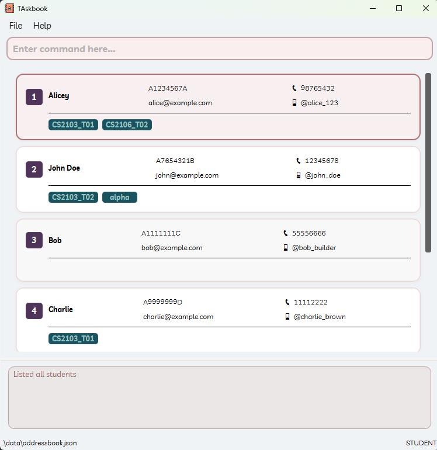

TAskbook is a **desktop app for managing contacts, optimized for use via a Command Line Interface** (CLI) while still having the benefits of a Graphical User Interface (GUI).
If you can type fast,
TAskbook can get your contact management tasks done faster than traditional GUI apps.

- Table of Contents
  {:toc}

---

## Quick start

1. Ensure you have Java `17` or above installed in your Computer. 
   **Mac users:** Ensure you have the precise JDK version prescribed [here](https://se-education.org/guides/tutorials/javaInstallationMac.html).

1. Download the latest `.jar` file from [here](https://github.com/AY2425S2-CS2103-F15-1/tp/releases).

1. Copy the file to the folder you want to use as the _home folder_ for your TAskbook.

1. Open a command terminal,
   `cd` into the folder you put the jar file in,
   and use the `java -jar taskbook.jar` command to run the application. 
   A GUI similar to the below should appear in a few seconds.
   Note how the app contains some sample data. 
   

1. Type the command in the command box and press Enter to execute it.
   e.g. typing **`help`** and pressing Enter will open the help window. 
   Some example commands you can try:

   - `list` : Lists all contacts.

   - `add n/John Doe i/A0123456Z p/98765432 e/johnd@example.com h/@john_doe` :
     Adds a contact named `John Doe` to the Address Book.

   - `delete 1` : Deletes the 1st contact shown in the current list.

   - `clear` : Deletes all contacts.

   - `exit` : Exits the app.

1. Refer to the [Features](#features) below for details of each command.

---

## Features

**:information_source: Notes about the command format:** 

- Words in `UPPER_CASE` are the parameters to be supplied by the user. 
  e.g. in `add n/NAME`, `NAME` is a parameter which can be used as `add n/John Doe`.

- Items in square brackets are optional. 
  e.g `n/NAME [t/TAG]` can be used as `n/John Doe t/friend` or as `n/John Doe`.

- Items with `...` after them can be used multiple times including zero times. 
  e.g. `[t/TUTORIAL_NAME]...` can be used as ` ` (i.e. 0 times), `t/cs2103`,
  `t/cs2103 t/cs2040s` etc.

- Parameters can be in any order. 
  e.g. if the command specifies `n/NAME p/PHONE`, `p/PHONE n/NAME` is also acceptable.

- Extraneous parameters for commands that do not take in parameters
  (such as `help`, `list`, `exit` and `clear`) will be ignored. 
  e.g. if the command specifies `help 123`, it will be interpreted as `help`.

- If you are using a PDF version of this document,
be careful when copying and pasting commands that span multiple lines
as space characters surrounding line-breaks may be omitted when copied over to the application.

### Viewing help : `help`

Shows a message explaining how to access the help page.

Format: `help`

### Adding a student: `add`

Adds a student to the address book.

Format: `add n/NAME i/STUDENT_ID p/PHONE e/EMAIL h/HANDLE [t/TUTORIAL]...`

:bulb: **Tip:**
A student can have any number of tags (including 0)

Examples:

- `add n/John Doe i/A0123456Z p/98765432 e/johnd@example.com h/@john_doe`
- `add n/John Doe i/A0123456Z p/98765432 e/johnd@example.com h/@john_doe t/CS2103_T01 t/CS2106_T02`

### Listing all students: `list`

Shows a list of all students in the address book.

Format: `list`

### Editing a student: `edit`

Edits an existing student in the address book.

Format: `edit INDEX [n/NAME] [i/STUDENT_ID] [p/PHONE] [e/EMAIL] [h/HANDLE] [t/TUTORIALS]...`

- Edits the student at the specified `INDEX`.
  The index refers to the index number shown in the displayed student list.
  The index **must be a positive integer** 1, 2, 3, ...
- At least one of the optional fields must be provided.
- Existing values will be updated to the input values.
- When editing tutorial slots,
  the existing set of tutorials allocated to the student will be replaced entirely with the new values provided i.e. adding of tutorials is not cumulative.
- You can remove all the student’s tutorial slots by typing `t/` without
  specifying any tutorials after it.

Examples:

- `edit 1 p/91234567 e/johndoe@example.com`
  Edits the phone number and email address of the 1st student to be `91234567` and `johndoe@example.com` respectively.
- `edit 2 n/Betsy Crower t/`
  Edits the name of the 2nd student to be `Betsy Crower` and clears all existing tutorial slots.

<!-- ### Locating students by name: `find` -->
<!---->
<!-- Finds students whose names contain any of the given keywords. -->
<!---->
<!-- Format: `find KEYWORD [MORE_KEYWORDS]` -->
<!---->
<!-- * The search is case-insensitive. e.g `hans` will match `Hans` -->
<!-- * The order of the keywords does not matter. e.g. `Hans Bo` will match `Bo Hans` -->
<!-- * Only the name is searched. -->
<!-- * Only full words will be matched e.g. `Han` will not match `Hans` -->
<!-- * Students matching at least one keyword will be returned (i.e. `OR` search). -->
<!--   e.g. `Hans Bo` will return `Hans Gruber`, `Bo Yang` -->
<!---->
<!-- Examples: -->
<!-- * `find John` returns `john` and `John Doe` -->
<!-- * `find alex david` returns `Alex Yeoh`, `David Li`  -->
<!--    -->

### Deleting a student: `delete`

Deletes the specified student from the address book.

Format: `delete INDEX`

- Deletes the student at the specified `INDEX`.
- The index refers to the index number shown in the displayed student list.
- The index **must be a positive integer** 1, 2, 3, ...

Examples:

- `list` followed by `delete 2` deletes the 2nd student in the address book.
<!-- * `find Betsy` followed by `delete 1` deletes the 1st student in the results of the `find` command. -->

### Adding a tutorial: `tutorial add`

Adds a tutorial slot to the address book.

Format: `tutorial add NAME`

- `NAME` can contain only: alphanumeric characters, underscore and hyphen.

Examples:

- `tutorial add cs2103-f15`

### Deleting a tutorial: `tutorial delete`

Deletes a tutorial slot from the address book.

Format: `tutorial delete NAME`

- `NAME` can contain only: alphanumeric characters, underscore and hyphen.

Examples:

- `tutorial delete cs2103-f15`

### Listing all tutorials : `tutorial list`

Shows a list of all tutorials in the address book.

Format: `tutorial list`

### Adding a student to a tutorial: `tutorial add-student`

Adds a student to a tutorial slot.

Format: `tutorial add-student TUTORIAL_NAME s/STUDENT_INDEX...`

- `STUDENT_INDEX` **must be a positive integer** 1, 2, 3, ...

Examples:

- `list` then `tutorial add-student cs2103-f15 s/1`:
  Adds the 1st student in the list to the tutorial slot `cs2103-f15`.

### Deleting a student to a tutorial: `tutorial delete-student`

Deletes a student from a tutorial slot.

Format: `tutorial delete-student TUTORIAL_NAME s/STUDENT_INDEX...`

- `STUDENT_INDEX` **must be a positive integer** 1, 2, 3, ...

Examples:

- `list` then `tutorial delete-student cs2103-f15 s/1`:
  Deletes the 1st student in the list from the tutorial slot `cs2103-f15`.

### Listing attendance: `attendance list`

Shows a list of attendances in the address book. It can list all attendances, the attendance for a specific student or
attendance for a specific tutorial.

Format: `attendance list [INDEX]`

- `INDEX` **must be a positive integer** 1, 2, 3, ...
- If the command is run from the student view, `INDEX` refers to the index number shown in the student list.
- If the command is run from the tutorial view, `INDEX` refers to the index number shown in the tutorial list.

Examples:

- From student view, `attendance list 1` lists the attendance of the first student on the list.
- From tutorial view, `attendance list 1` lists the attendance of the first tutorial on the list.
- If there are invalid arguments, i.e. `attendance list a`, the default behaviour will list all attendances in the 
address book.

### Mark attendance: `attendance mark`

Marks student(s) attendance for a specified week.

Format: `attendance mark w/WEEK i/INDEX...`

- `WEEK` **must be a positive integer** from 3 to 13 (inclusive).
- `INDEX` **must be a positive integer** 1, 2, 3, ...
- `INDEX` refers to the index number shown in the displayed attendance list.

Examples:

- `attendance list`, then `attendance mark w/3 i/1`
- `attendance list`, then `attendance mark w/13 i/1 i/2`
- From student view or tutorial view, `attendance mark` command will bring the user to attendance view and list all
attendances.

### Unmark attendance: `attendance unmark`

Unmarks student(s) attendance for a specified week.

Format: `attendance unmark w/WEEK i/INDEX...`

- `WEEK` **must be a positive integer** from 3 to 13 (inclusive).
- `INDEX` **must be a positive integer** 1, 2, 3, ...
- `INDEX` refers to the index number shown in the displayed attendance list.

Examples:

- `attendance list`, then `attendance unmark w/3 i/1`
- `attendance list`, then `attendance unmark w/13 i/1 i/2`
- From student view or tutorial view, `attendance unmark` command will bring the user to attendance view and list all
  attendances.

### Clearing all entries : `clear`

Clears all entries from the address book.

Format: `clear`

### Exporting Students and Tutorials : `export`

Exports the list of students and tutorials to `data/students.csv` and `data/tutorials.csv` respectively.

Format: `export`

### Exporting Students : `export students`

Exports the list of students to `data/students.csv`.

Format: `export students`

Exports the list of students from a specified tutorial to `data/students-TUTORIAL_NAME.csv`.

Format: `export students TUTORIAL_NAME`

Examples:

- `export students`
- `export students CS2103-T2`

### Exporting Tutorials : `export tutorials`

Exports the list of tutorials to `data/tutorials.csv`.

Format: `export tutorials`

### Exiting the program : `exit`

Exits the program.

Format: `exit`

### Saving the data

TAskbook data are saved in the hard disk automatically after any command that changes the data.
There is no need to save manually.

### Editing the data file

TAskbook data are saved automatically as a JSON file `[JAR file location]/data/addressbook.json`.
Advanced users are welcome to update data directly by editing that data file.

:exclamation: **Caution:**
If your changes to the data file makes its format invalid,
TAskbook will discard all data and start with an empty data file at the next run.
Hence, it is recommended to take a backup of the file before editing it. 
Furthermore, certain edits can cause the TAskbook to behave in unexpected ways
(e.g., if a value entered is outside of the acceptable range).
Therefore, edit the data file only if you are confident that you can update it correctly.

<!-- ### Archiving data files `[coming in v2.0]` -->
<!---->
<!-- _Details coming soon ..._ -->

---

## FAQ

**Q**: How do I transfer my data to another Computer? 
**A**: Install the app in the other computer
and overwrite the empty data file it creates with the file that contains the data of your previous TAskbook home folder.

---

## Known issues

1. **When using multiple screens**, if you move the application to a secondary screen,
   and later switch to using only the primary screen,
   the GUI will open off-screen.
   The remedy is to delete the `preferences.json` file created by the application before running the application again.
2. **If you minimize the Help Window** and then run the `help` command
   (or use the `Help` menu, or the keyboard shortcut `F1`) again,
   the original Help Window will remain minimized,
   and no new Help Window will appear.
   The remedy is to manually restore the minimized Help Window.

---

## Command summary

| **Action**                        | **Format, Examples**                                                                                                                                                         |
|-----------------------------------| ---------------------------------------------------------------------------------------------------------------------------------------------------------------------------- |
| **Help**                          | `help`                                                                                                                                                                       |
| **Add student**                   | `add n/NAME i/STUDENT_ID p/PHONE e/EMAIL h/HANDLE [t/TUTORIAL]...` e.g., `add n/John Doe i/A0123456Z p/98765432 e/johnd@example.com h/@johndoe t/CS2103_T01 t/CS2106_T02` |
| **List students**                 | `list`                                                                                                                                                                       |
| **Edit student**                  | `edit INDEX [n/NAME] [i/STUDENT_ID] [p/PHONE] [e/EMAIL] [h/HANDLE] [t/TUTORIALS]...` e.g., `edit 1 p/91234567 e/johndoe@example.com`                                      |
| **Delete student**                | `delete INDEX` e.g., `delete 2`                                                                                                                                           |
| **Tutorial Add**                  | `tutorial add NAME` e.g., `tutorial add cs2103-f15`                                                                                                                       |
| **Tutorial Delete**               | `tutorial delete NAME` e.g., `tutorial delete cs2103-f15`                                                                                                                 |
| **Tutorial List**                 | `tutorial list`                                                                                                                                                              |
| **Add student to tutorial**       | `tutorial add-student TUTORIAL_NAME s/STUDENT_INDEX` e.g., `tutorial add-student cs2103-f15 s/1`                                                                          |
| **Delete student from tutorial**  | `tutorial delete-student TUTORIAL_NAME s/STUDENT_INDEX` e.g., `tutorial delete-student cs2103-f15 s/1`                                                                    |
| **List attendances**              | `attendance list [INDEX]` e.g., `attendance list`                                                                                                                         |
| **Mark attendance**               | `attendance mark w/WEEK i/INDEX...` e.g., `attendance mark w/4 i/1`                                                                                                       |
| **Unmark attendance**             | `attendance unmark w/WEEK i/INDEX...` e.g., `attendance unmark w/4 i/1`                                                                                                   |
| **Export students and tutorials** | `export`                                                                                                                                                                     |
| **Export students**               | `export students [TUTORIAL_NAME]` e.g., `export students` e.g., `export students CS2103-T2`                                                                            |
| **Export tutorials**              | `export tutorials`                                                                                                                                                           |
| **Clear**                         | `clear`                                                                                                                                                                      |
| **Exit**                          | `exit`                                                                                                                                                                       |
