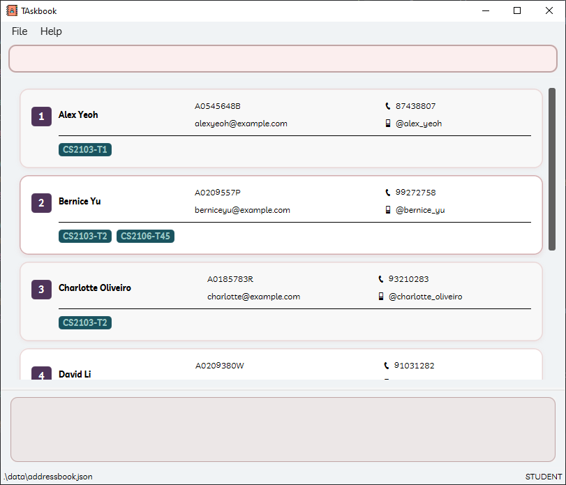
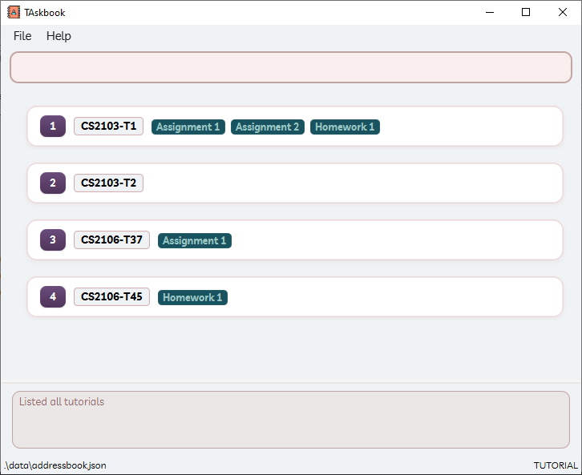
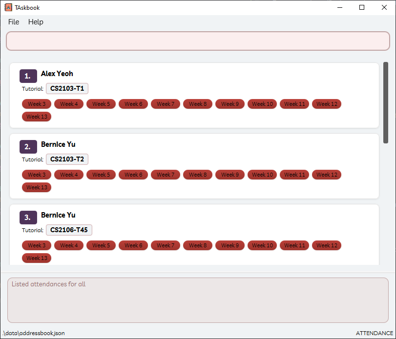
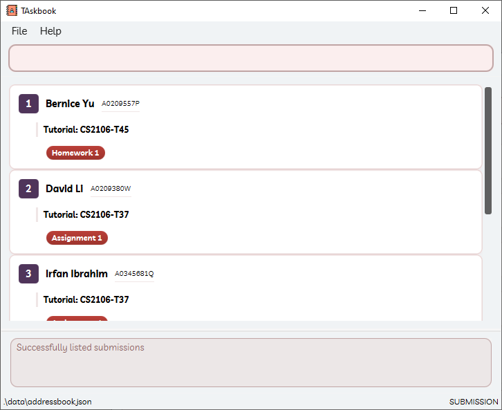
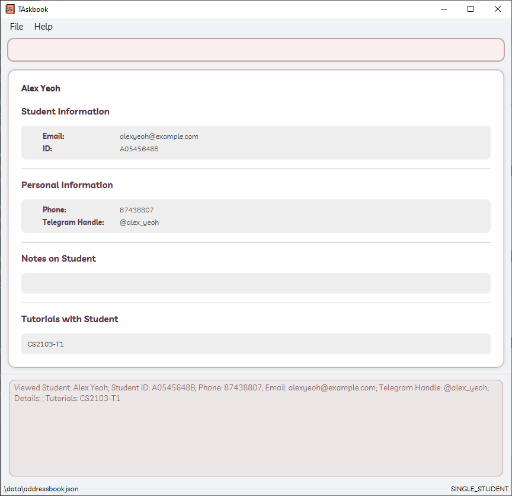

## TAskbook User Guide

TAskbook is a **desktop app for managing students, optimized for use via a Command Line Interface** (CLI) while still having the benefits of a Graphical User Interface (GUI).
If you can type fast,
TAskbook can get your student management tasks done faster than traditional GUI apps.

## Table of Contents

<!-- prettier-ignore -->
- Table of Content
{:toc}

---

## Quick start

1. Ensure you have Java `17` or above installed in your Computer. 
   **Mac users:** Ensure you have the precise JDK version prescribed [here](https://se-education.org/guides/tutorials/javaInstallationMac.html).

1. Download the latest `.jar` file from [here](https://github.com/AY2425S2-CS2103-F15-1/tp/releases).

1. Copy the file to the folder you want to use as the _home folder_ for your TAskbook.

1. Open a command terminal,
   `cd` into the folder you put the jar file in,
   and use the `java -jar taskbook.jar` command to run the application. 
   A GUI similar to the below should appear in a few seconds.
   Note how the app contains some sample data. 
   

1. Type the command in the command box and press Enter to execute it.
   e.g. typing **`help`** and pressing Enter will open the help window. 
   Some example commands you can try:

   - `list`: Lists all students.

   - `add n/John Doe i/A0123456Z p/98765432 e/johnd@example.com h/@john_doe`:
     Adds a student named `John Doe` to the Address Book.

   - `delete 1`: Deletes the 1st student shown in the current list.

   - `clear`: Deletes all students.

   - `exit`: Exits the app.

1. Refer to the [Features](#features) section below for details of each command.

---

## Application Views

TAskbook operates in distinct views, which determine the information shown in the UI and what commands are available.
The current view is indicated in the bottom-right corner of the application window.

**:information_source: Note about views:** 

- Some commands are only available in specific views.
  If a command is entered in the wrong view, the application will automatically switch to the correct view.

- The current view is remembered across reboots of the application.

- For command-specific view requirements, please refer to the [Features](#features) section.

---

### Types of Views

#### STUDENT view

For managing students and their tutorial enrollment.  

#### TUTORIAL view

For managing tutorials and their assignments.  

#### ATTENDANCE view

For tracking student attendance.  

#### SUBMISSION view

For managing student submissions and their statuses.  

#### SINGLE_STUDENT view

For viewing comprehensive details of a specific student.  

---

### Switching Views

The user can switch between views using the following commands:

| Command           | View                    |
| ----------------- | ----------------------- |
| `list`            | **STUDENT view**        |
| `tutorial list`   | **TUTORIAL view**       |
| `attendance list` | **ATTENDANCE view**     |
| `submission list` | **SUBMISSION view**     |
| `view INDEX`      | **SINGLE_STUDENT view** |

For more information on these commands, please refer to the [Features](#features) section.

---

## Features

**:information_source: Notes about the command format:** 

- Words in `UPPER_CASE` are the parameters to be supplied by the user. 
  e.g. in `add n/NAME`, `NAME` is a parameter which can be used as `add n/John Doe`.

- Items in square brackets are optional. 
  e.g `n/NAME [t/TAG]` can be used as `n/John Doe t/friend` or as `n/John Doe`.

- Items with `...` after them can be used multiple times including zero times. 
  e.g. `[t/TUTORIAL_NAME]...` can be used as ` ` (i.e. 0 times), `t/cs2103`,
  `t/cs2103 t/cs2040s` etc.

- Parameters can be in any order. 
  e.g. if the command specifies `n/NAME p/PHONE`, `p/PHONE n/NAME` is also acceptable.

- Extraneous parameters for commands that do not take in parameters
  (such as `help`, `list`, `exit` and `clear`) will be ignored. 
  e.g. if the command specifies `help 123`, it will be interpreted as `help`.

- If you are using a PDF version of this document,
  be careful when copying and pasting commands that span multiple lines
  as space characters surrounding line-breaks may be omitted when copied over to the application.

---

### Command - Viewing help: `help`

**Format**:  
`help`

Shows a message explaining how to access the help page.

---

### Command - Clearing all entries: `clear`

Clears all entries from the address book.

**Format**:  
`clear`

---

### Command - Exiting the program: `exit`

Exits the program.

**Format**:  
`exit`

---

### Student Commands

#### Command - Adding a student: `add`

Adds a student to the address book.

**Format**:  
`add n/NAME i/STUDENT_ID p/PHONE e/EMAIL h/HANDLE [desc/DESCRIPTION]`

**Parameters**:
- `NAME`: Alphanumeric characters and spaces only (cannot be blank)
- `STUDENT_ID`: Format `AXXXXXXX[A-Z]` where `X` is a number between 0 - 9
    - cannot be blank, must be unique
- `PHONE`: Exactly 8 digits
- `EMAIL`: Valid email format (e.g., user@example.com)
- `HANDLE`: Format `@telegramhandle` (min 3 chars, cannot be blank)
- `DESCRIPTION`: Max 50 characters
- There cannot be duplicate students with the same `NAME`, `STUDENT_ID`,
  `PHONE`, `EMAIL` or `HANDLE`.

**Examples**:

- `add n/John Doe i/A0123456Z p/98765432 e/johnd@example.com h/@john_doe`

> **Warning:**
>
> - As of v1.5, description attribute is temporary for the session and will disappear on reboot of app

---

#### Command - Listing all students: `list`

Shows a list of all students in the address book.

**Format**:  
`list`

---

#### Command - Editing a student: `edit`

Edits an existing student in the address book.
You must be in `STUDENT` view.

**Format**:  
`edit INDEX [n/NAME] [i/STUDENT_ID] [p/PHONE] [e/EMAIL] [h/HANDLE] [desc/DESCRIPTION]`

**Parameters**:
- The `INDEX` must be a positive integer (1, 2, 3, ...)
- At least one optional field must be provided

**Behavior**:

- Updates all specified fields with new values
- Preserves unspecified fields

**Examples**:

- `edit 1 p/91234567 e/johndoe@example.com`
  Edits the phone number and email address of the 1st student to be `91234567` and `johndoe@example.com` respectively.
- `edit 2 n/Betsy Crower`
  Edits the name of the 2nd student to be `Betsy Crower`

---

#### Command - Finding students: `find`

Finds all students whose names contain any of the specified keywords (case-insensitive)
or who are in the specified tutorial group(s).

**Format**:  
`find NAME... [t/TUTORIAL_NAME]`

**Parameters**:
- `NAME` can have multiple values, separated by spaces
- Search is case-insensitive
- Returns students matching ANY name keyword with the tutorial filter

**Behavior**:

- Displays results as a numbered list
- Shows nothing and flag out usage guidelines if no parameters provided
- Unsuccessful search returns empty list
- Tutorial filter must match existing tutorial names exactly

**Examples**:

- `find alice bob`:
  Finds any student(s) named alice or bob.
- `find t/CS2103_T02`:
  Finds any student(s) that has a tutorial CS2103_T02.
- `find alice bob t/CS2103_T02`:
  Finds any student(s) named alice or bob that has a tutorial CS2103_T02.
- `find alice bob t/CS2103_T02 t/CS2103_T03`:
  Finds any student(s) named alice or bob that is in any of the tutorials CS2103_T02 or CS2103_T03.

---

#### Command - Deleting a student: `delete`

Deletes the specified student from the address book.
You must be in `STUDENT` view.

**Format**:  
`delete INDEX`

**Parameters**:
- `INDEX` must be a positive integer (1, 2, 3,...)
- Refers to the position in the currently displayed list
- Operation cannot be undone

**Behavior**:

- Permanently removes the student record

**Examples**:

- `delete 3`:
  Deletes the 3rd student shown in the current list.
- `find Alex` followed by `delete 1`:
  Deletes the first student in the filtered 'Alex' results.
- `list` followed by `delete 2`:
  Deletes the 2nd student in the complete student list.

**Additional Note:**  
Deleted students are immediately removed from:
- Tutorial enrollments
- Submission records
- Attendance tracking

---

#### Command - Viewing student details: `view`

Displays comprehensive information for a specific student.
You must be in `STUDENT` view.

**Format**:  
`view INDEX`

**Parameters**:
- `INDEX`:
  - Must be a positive integer (1, 2, 3,...)
  - Corresponds to displayed student list position

**Behavior**:

- Shows complete student profile

**Example**:

- `view 1`:
  Displays full details for the first student in the current list.

---

### Tutorial Commands

#### Command - Adding a tutorial: `tutorial add`

Adds a tutorial slot to the address book.

**Format**:  
`tutorial add NAME`

**Parameters**:
- `NAME` requirements:
  - Must be unique (no duplicate tutorials)
  - Maximum 15 characters
  - Only alphanumeric, underscore (_) and hyphen (-) allowed
  - Case-sensitive (CS2103 ≠ cs2103)

**Behavior**:

- Creates new tutorial if all requirements met
- Rejects invalid names

**Examples**:

- `tutorial add cs2103-f15`:
  Creates tutorial "cs2103-f15" if valid and unique.
- `tutorial add lab_01`:
  Creates tutorial "lab_01" if doesn't exist.
- `tutorial add CS2040-T01`:
  Creates tutorial "CS2040-T01" if meets requirements.

---

#### Command - Listing all tutorials: `tutorial list`

Shows a list of all tutorials and created assignments in the address book.

**Format**:  
`tutorial list`

---

#### Command - Finding a tutorial: `tutorial find`

Finds tutorials matching specified keywords in their names.

**Format**:  
`tutorial find SEARCH...`

**Parameters**:
- `SEARCH` is case-insensitive
- Partial matches are allowed ("CS210" matches "CS2103_T01")
- Multiple space-separated keywords will find tutorials matching ANY keyword

**Behavior**:

- Displays results as a numbered list
- Returns empty list if no matches found

**Examples**:

- `tutorial find CS2103_T02`:
  Finds tutorial(s) with "cs2103_t02" in name (regardless of case).
- `tutorial find CS2103_T02 CS2103_T03`:
  Finds tutorials containing either "cs2103_t02" or "cs2103_t03".
- `tutorial find CS2103`:
  Finds all tutorials with "cs2103" anywhere in their names.

---

#### Command - Deleting a tutorial: `tutorial delete`

Deletes a tutorial slot from the address book.

**Format**:  
`tutorial delete TUTORIAL_NAME`

**Parameters**:
- `TUTORIAL_NAME` must:
  - Exactly match an existing tutorial name (case-sensitive)
  - Contain only alphanumeric characters, underscores (_), and hyphens (-)
  - Not be blank

**Behavior**:

- Permanently removes the tutorial
- Automatically unenrolls all students from this tutorial
- Maintains student records (only removes tutorial association)

**Examples**:

- `tutorial delete cs2103-f15`:
  Deletes the tutorial named exactly "cs2103-f15".
- `tutorial delete Lab_Section1`:
  Deletes the tutorial named exactly "Lab_Section1".

---

#### Command - Adding a student to tutorial: `tutorial add-student`

Adds a student to a tutorial slot.
You must be in `STUDENT` view.

**Format**:  
`tutorial add-student TUTORIAL_NAME s/STUDENT_INDEX...`

**Parameters**:
- `STUDENT_INDEX` must be:
  - A positive integer (1, 2, 3,...)
  - Valid for current student list display
- `TUTORIAL_NAME` must exactly match an existing tutorial (case sensitive)
- Students cannot be added to the same tutorial multiple times

**Behavior**:

- Adds student to specified tutorial
- No effect if student already in tutorial

**Examples**:

- `list` then `tutorial add-student cs2103-f15 s/1`:
  Adds the 1st displayed student to tutorial "cs2103-f15".
- `find Alice` then `tutorial add-student cs2101-t03 s/1`:
  Adds Alice (1st in filtered list) to tutorial "cs2101-t03".

---

#### Command - Deleting a student from tutorial: `tutorial delete-student`

Removes a student from a tutorial slot.
You must be in `STUDENT` view.

**Format**:  
`tutorial delete-student TUTORIAL_NAME s/STUDENT_INDEX...`

**Parameters**:
- `STUDENT_INDEX` must be:
  - A positive integer (1, 2, 3,...)
  - Valid for current student list display
- `TUTORIAL_NAME` must exactly match an existing tutorial (case sensitive)
- Operation affects only tutorial enrollment

**Behavior**:

- Removes student from specified tutorial
- No effect if student not enrolled in tutorial

**Examples**:

- `list` then `tutorial delete-student cs2103-f15 s/1`:
  Removes the 1st displayed student from tutorial "cs2103-f15".
- `find Alice` then `tutorial delete-student cs2101-t03 s/1`:
  Removes Alice (1st in filtered list) from tutorial "cs2101-t03".

---

### Assignment Commands

#### Command - Listing assignments

**Note**

There is no command for listing assignments.
They can be viewed in the `TUTORIAL` view.
Type `tutorial list` to view tutorials and its corresponding assignments.

#### Command - Adding an assignment: `assignment add`

Creates a new assignment for specified tutorials.
You must be in `TUTORIAL` view.

**Format**:  
`assignment add ASSIGNMENT_NAME [t/TUTORIAL_INDEX]... [d/DUE_DATE]`

**Parameters**:
- `ASSIGNMENT_NAME` must:
  - Be 1-35 characters long
  - Contain only: letters (A-Z,a-z), digits (0-9), underscores (_), hyphens (-) and spaces
  - Be case-sensitive ("Lab_1" ≠ "lab_1")
  - Be unique per tutorial
- `TUTORIAL_INDEX` must:
  - Be a positive integer for existing tutorials
  - Can be multiple
- `DUE_DATE` (optional) must:
  - Use exact format: `uuuu-MM-dd HH:mm`
- Interface will require manual adjustment for long names (>5 chars)
- Tutorial indexes refer to current display order
- Duplicate assignments will be rejected with error
- Invalid date formats will be rejected

**Examples**:

- `assignment add Lab1 t/1 t/2`:
  Creates basic assignment for listed tutorials in index 1 and 2.
- `assignment add Final_Project t/3 d/2023-12-15 16:00`:
  Creates assignment with due date.
- `assignment add Quiz-1 t/1 t/99`:
  Only creates for valid tutorial (ignores invalid).

**Behaviour**:

- An error will be shown (but the rest of the tutorials will be processed):
  - Invalid tutorial indexes will
  - Assignments not in specified tutorial

---

#### Command - Deleting an assignment: `assignment delete`

Removes an assignment from specified tutorials.
You must be in `TUTORIAL` view.

**Format**:  
`assignment delete ASSIGNMENT_NAME [t/TUTORIAL_INDEX]...`

**Parameters**:
- `ASSIGNMENT_NAME` must:
  - Match exactly (case-sensitive)
  - Exist in the specified tutorial
- `TUTORIAL_INDEX` refers to:
  - Current display position (after any filters)
  - Must be a positive integer
  - Can be multiple

**Behavior**:

- Removes assignment from all specified tutorials
- An error will be shown (but the rest of the tutorials will be processed):
  - Invalid tutorial indexes will
  - Assignments not in specified tutorial
- Preserves all student submissions

**Examples**:

- `assignment delete Lab1 t/1`:
  Deletes "Lab1" from tutorial at position 1 in current view.
- `list` then `assignment delete Final_Project t/2 t/3`:
  Deletes "Final_Project" from tutorials at positions 2 and 3.
- `tutorial find cs2103` then `assignment delete Quiz1 t/1`:
  Deletes "Quiz1" from first tutorial in filtered CS2103 list.

---

### Submission Commands

#### Command - Listing submissions: `submission list`

Displays a comprehensive overview of all student enrollments
and their assignment completion status across tutorials.

**Format**:  
`submission list`

---

#### Command - Setting submission status: `submission set`

Updates the completion status of specified student submissions.

**Format**:  
`submission set STATE t/TUTORIAL_NAME a/ASSIGNMENT_NAME s/STUDENT_NAME`

**Parameters**:

- `STATE`: Required completion state (`not-submitted` \| `submitted` \| `graded`)
- `TUTORIAL_NAME`: Case-sensitive exact tutorial name match
- `ASSIGNMENT_NAME`: Case-sensitive exact assignment name match
- `STUDENT_NAME`: Case-sensitive exact student name match

**Behavior**:

- Rejects entire operation if any parameter is invalid

**Examples**:

- `submission set submitted t/CS2103-F15 a/Midterm s/Bernice Yu`:
  Marks Bernice Yu's submission as "submitted".
- `submission set graded t/CS2103-F15 a/Midterm s/Alex Yeoh s/Charlotte Li`:
  Records "graded" status for two students' midterms.

---

### Attendance Commands

#### Command - Listing attendance: `attendance list`

Displays attendance records for students or tutorials.
You can be in any view to execute this command,
but different views have different behaviors.

**Format**:  
`attendance list [INDEX]`

**Parameters**:
- `INDEX`:
  - Positive integer (1, 2, 3,...)
  - Context-sensitive interpretation:
    - In student view: refers to student index
    - In tutorial view: refers to tutorial index

**Behavior**:

- Without index: shows all attendance records
- With index: shows records for specified student/tutorial
- Multiple entries possible per student (across different tutorials)
- Invalid input defaults to full attendance list
- Displays:
  - Week numbers
  - Attendance status (Present/Absent)

**Examples**:

- `list` then `attendance list 1`:
  Shows attendance for all tutorials under the first student in current student list.
- `tutorial list` then `attendance list 2`:
  Shows attendance for all students enrolled in second tutorial in current tutorial list.
- `attendance list`:
  Displays complete attendance records for all students (one student one tutorial per row).

**Parameters**:
For accurate results:
1. First use `list` or `tutorial list`
2. Then specify the desired index  
  - This ensures correct context for the attendance query

---

#### Command - Marking attendance: `attendance mark`

Records student attendance for a specific week.
You must be in `ATTENDANCE` view.

**Format**:  
`attendance mark w/WEEK i/INDEX...`

**Parameters**:
- `WEEK`:
  - Single week number (3-13 inclusive)
  - Only one `w/` parameter allowed per command
- `INDEX`:
  - One or more positive integers
  - Refers to positions in current attendance list
  - Invalid indexes are skipped and an error message will be shown

**Behavior**:

- Marks specified students as "Present" for the week
- Handles multiple students in single command

**Examples**:

- `attendance mark w/3 i/1`:
  Marks first student in attendance list as present for week 3.
- `attendance mark w/13 i/1 i/2`:
  Marks students at positions 1 and 2 as present for week 13.

> **Usage Notes**:
>
> - Always check current attendance list before marking
> - Changes take effect immediately

---

#### Command - Unmarking attendance: `attendance unmark`

Removes attendance records for specified students in a given week.
You must be in `ATTENDANCE` view.

**Format**:  
`attendance unmark w/WEEK i/INDEX...`

**Parameters**:
- `WEEK`:
  - Single week number (3-13 inclusive)
  - Only one `w/` parameter allowed per command
- `INDEX`:
  - One or more positive integers
  - Refers to positions in current attendance list
  - Invalid indexes are skipped and an error message will be shown

**Behavior**:

- Sets specified students' status to "Absent" for the week
- Processes multiple students in a single command

**Examples**:

- `attendance unmark w/3 i/1`:
  Removes attendance mark for first student in week 3.
- `attendance unmark w/13 i/1 i/2`:
  Unmarks attendance for students at positions 1 and 2 in week 13.

> **Usage Notes**:
>
> - Verify current attendance list before unmarking
> - Changes are immediate and irreversible

---

### Export Commands

#### Command - Command - Exporting data: `export`

Generates CSV files of system data for external use.

##### Export All Data

**Format**:  
`export`

**Behavior**:

- Creates two files:
  - `data/students.csv` (all student records)
  - `data/tutorials.csv` (all tutorial records)
- Overwrites existing files without confirmation
- Includes all active records regardless of current view

##### Export Students

**Format**:  
`export students [TUTORIAL_NAME]`

**Parameters**:
- `TUTORIAL_NAME`:
  - Case-sensitive exact tutorial name
  - Optional (exports all students if omitted)

**Behavior**:

- Without parameter: `data/students.csv` (all students)
- With parameter: `data/students-TUTORIAL_NAME.csv`
- Only includes currently enrolled students
- Preserves special characters in names

**Examples**:

- `export students`:
  Exports all students to students.csv.
- `export students CS2103-T2`:
  Creates students-CS2103-T2.csv with tutorial-specific enrollments.

##### Export Tutorials

**Format**:  
`export tutorials`

**Behavior**:

- Generates `data/tutorials.csv`
- Includes all tutorial metadata
- Maintains original creation timestamps

**System Notes**:

- CSV format uses UTF-8 encoding
- First row contains column headers
- Files are overwritten silently
- Export directory must exist
- Partial exports may occur if data is corrupted

---

## Saving the data

TAskbook data are saved in the hard disk automatically after any command that changes the data.
There is no need to save manually.

## Editing the data file

TAskbook data are saved automatically as a JSON file `[JAR file location]/data/addressbook.json`.
Advanced users are welcome to update data directly by editing that data file.

:exclamation: **Caution:**
If your changes to the data file makes its format invalid,
TAskbook will discard all data and start with an empty data file at the next run.
Hence, it is recommended to take a backup of the file before editing it. 
Furthermore, certain edits can cause the TAskbook to behave in unexpected ways
(e.g., if a value entered is outside of the acceptable range).
Therefore, edit the data file only if you are confident that you can update it correctly.

## FAQ

**Q**: How do I transfer my data to another Computer? 
**A**: Install the app in the other computer and overwrite the empty data file it creates with the file that contains the data of your previous TAskbook home folder.

## Known issues

1. **Multi-screen display**:  
   When moving the application between screens, the GUI may open off-screen.  
   _Fix_: Delete `preferences.json` before restarting.

2. **Help Window**:  
   Minimized help windows don't restore properly when reopening help.  
   _Fix_: Manually restore the window.

3. **Data Synchronization (v1.5)**:

   - Add the ability to edit tutorial by using Tutorial tags (`t/`)
   - Student descriptions are session-only (lost on app restart)

4. **Data Export (v1.5)**:

   - Doesn't include:
     - Submission histories
     - Attendance records
   - Limited to current session data

5. **Interface Issues**:

   - Window resizing required for long assignment names (>5 chars)
   - Tutorial indexes change after filtering/sorting

6. **System Limitations**:
   - No bulk operations across multiple tutorials
   - Orphaned submissions may exist after deletions

_View Planned resolutions in Developer Guide for more information_

## Command Summary

| **Action**                     | **Required View**                               | **Format, Examples**                                                                                                                                  |
| ------------------------------ | ----------------------------------------------- | ----------------------------------------------------------------------------------------------------------------------------------------------------- |
| **Student Management**         |                                                 |                                                                                                                                                       |
| `Add student`                  |                                                 | `add n/NAME i/STUDENT_ID p/PHONE e/EMAIL h/HANDLE [desc/DESCRIPTION]` e.g., `add n/John Doe i/A0123456Z p/98765432 e/johnd@example.com h/@johndoe` |
| `Edit student`                 | `STUDENT`                                       | `edit INDEX [n/NAME] [i/STUDENT_ID] [p/PHONE] [e/EMAIL] [h/HANDLE] [desc/DESCRIPTION]` e.g., `edit 1 p/91234567`                                   |
| `Delete student`               | `STUDENT`                                       | `delete INDEX` e.g., `delete 2`                                                                                                                    |
| `List students`                |                                                 | `list`                                                                                                                                                |
| `View student`                 | `STUDENT`                                       | `view INDEX` e.g., `view 2`                                                                                                                        |
| `Find students`                |                                                 | `find NAME [t/TUTORIAL]` e.g., `find Alice t/CS2103`                                                                                               |
| **Tutorial Management**        |                                                 |                                                                                                                                                       |
| `Add tutorial`                 |                                                 | `tutorial add NAME` e.g., `tutorial add cs2103-f15`                                                                                                |
| `Delete tutorial`              |                                                 | `tutorial delete NAME` e.g., `tutorial delete cs2103-f15`                                                                                          |
| `List tutorials`               |                                                 | `tutorial list`                                                                                                                                       |
| `Find tutorials`               |                                                 | `tutorial find NAME` e.g., `tutorial find CS2103`                                                                                                  |
| `Add student to tutorial`      | `STUDENT`                                       | `tutorial add-student TUTORIAL s/INDEX...` e.g., `tutorial add-student cs2103-f15 s/1`                                                             |
| `Remove student from tutorial` | `STUDENT`                                       | `tutorial delete-student TUTORIAL s/INDEX...` e.g., `tutorial delete-student cs2103-f15 s/1`                                                       |
| **Academic Tracking**          |                                                 |                                                                                                                                                       |
| `Add assignment`               | `TUTORIAL`                                      | `assignment add NAME t/TUTORIAL... [d/DATE]` e.g., `assignment add Lab1 t/1 d/2023-11-30 14:00`                                                    |
| `Delete assignment`            | `TUTORIAL`                                      | `assignment delete NAME t/TUTORIAL...` e.g., `assignment delete Lab1 t/1`                                                                          |
| `Mark attendance`              | `ATTENDANCE`                                    | `attendance mark w/WEEK i/INDEX...` e.g., `attendance mark w/4 i/1`                                                                                |
| `Unmark attendance`            | `ATTENDANCE`                                    | `attendance unmark w/WEEK i/INDEX...` e.g., `attendance unmark w/4 i/1`                                                                            |
| `List attendance`              | `STUDENT` or `TUTORIAL` if `INDEX` is specified | `attendance list [INDEX]` e.g., `attendance list 1`                                                                                                |
| `Set submission status`        |                                                 | `submission set STATE t/TUTORIAL a/ASSIGNMENT s/STUDENT...` e.g., `submission set submitted t/cs2103 a/lab1 s/Alice`                               |
| `List submissions`             |                                                 | `submission list [s/STUDENT] [t/TUTORIAL] [a/ASSIGNMENT]` e.g., `submission list t/cs2103 a/lab1`                                                  |
| **Data Export**                |                                                 |                                                                                                                                                       |
| `Export all`                   |                                                 | `export`                                                                                                                                              |
| `Export students`              |                                                 | `export students [TUTORIAL]` e.g., `export students CS2103-T2`                                                                                     |
| `Export tutorials`             |                                                 | `export tutorials`                                                                                                                                    |
| **System**                     |                                                 |                                                                                                                                                       |
| `Clear data`                   |                                                 | `clear`                                                                                                                                               |
| `Help`                         |                                                 | `help`                                                                                                                                                |
| `Exit`                         |                                                 | `exit`                                                                                                                                                |

## Troubleshooting

1. **Data not saving**: Ensure you have write permissions in the installation directory.
2. **Invalid command errors**: Check for exact parameter formats and case sensitivity.
3. **Missing features**: Some advanced features are planned for v2.0.

## Acknowledgements

- Built using JavaFX
- Inspired by AddressBook-Level3
